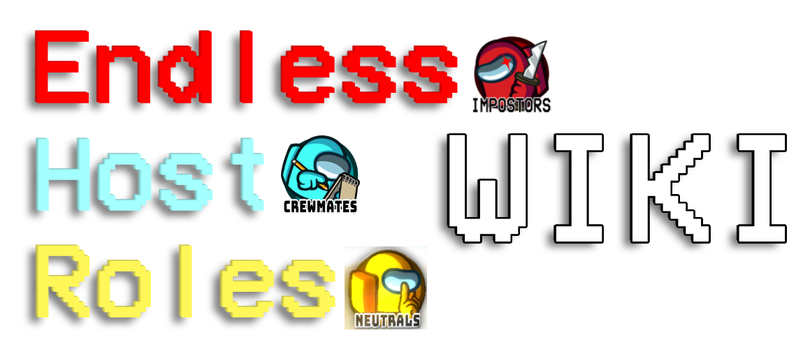

<div align="center">

# EHR Wiki

### Official Documentation for Endless Host Roles

[](https://ehr-wiki.gurge44.eu)
[](https://github.com/Gurge44/EndlessHostRoles)
[](https://discord.gg/ehr)

**Comprehensive documentation for the largest Host-Only Among Us mod with 450+ roles, 16 game modes and Endless customisation**



---

[](https://astro.build/)
[](https://starlight.astro.build/)
[](https://www.netlify.com/)
[](LICENSE)

</div>

## 🌟 About

This repository powers the **EHR Wiki** - a comprehensive documentation site for [Endless Host Roles](https://github.com/Gurge44/EndlessHostRoles). Built with modern web technologies, it provides:

- **Detailed Guides** — Installation, setup, and gameplay tutorials
- **Role Encyclopedia** — Complete descriptions of 450+ unique roles
- **Command Reference** — Full documentation of chat commands
- **Configuration Docs** — In-depth settings and customization options
- **Game Mode Guides** — Strategies for all 16 game modes

## 🛠️ Tech Stack

<table>
<tr>
<td align="center" width="33%">

<br><strong>Astro</strong>
<br><sub>Web Framework</sub>
</td>
<td align="center" width="33%">

<br><strong>Starlight</strong>
<br><sub>Docs Theme</sub>
</td>
<td align="center" width="33%">

<br><strong>Netlify</strong>
<br><sub>Hosting</sub>
</td>
</tr>
</table>

## 🚀 Quick Start

### Prerequisites


### Installation & Development

```bash
# Clone the repository
git clone https://github.com/Gurge44/ehr-wiki.git
cd ehr-wiki

# Install dependencies
npm install
# or
pnpm install

# Start development server
npm run dev
```

Open [http://localhost:4321](http://localhost:4321) in your browser

### Build for Production

```bash
# Build the site
npm run build

# Preview production build locally
npm run preview
```

## 📂 Project Structure

```
ehr-wiki-deploy/
│
├── public/              # Static assets (images, icons, fonts)
│   └── ehr_wiki.png
│
├── src/
│   ├── content/
│   │   ├── docs/       # Documentation pages (Markdown/MDX)
│   │   │   ├── guides/
│   │   │   ├── roles/
│   │   │   ├── settings/
│   │   │   └── ...
│   │   └── config.ts   # Starlight configuration
│   │
│   └── assets/         # Optimized images & assets
│
├── astro.config.mjs     # Astro configuration
├── package.json
└── README.md
```

## 🤝 Contributing

We love contributions! Whether you're fixing typos, adding new guides, or improving existing documentation, your help is appreciated.

### Documentation Updates

1. **Fork** this repository
2. **Create** a new branch
   ```bash
   git checkout -b improve-docs
   ```
3. **Edit** the relevant `.md` or `.mdx` files in `src/content/docs/`
4. **Commit** your changes
   ```bash
   git commit -m 'Update role descriptions'
   ```
5. **Push** to your branch
   ```bash
   git push origin improve-docs
   ```
6. **Open** a Pull Request

### Adding New Pages

Simply create new `.md` files in the appropriate directory under `src/content/docs/`. Starlight will automatically:
- Add them to the navigation
- Generate the sidebar
- Handle routing

### Reporting Issues

Found a problem? [Open an issue](https://github.com/Gurge44/EndlessHostRoles/issues) and include:
- What's wrong or outdated
- Which page it's on
- Suggested correction (if applicable)

## 🚀 Deployment

The site is automatically deployed to **Netlify** when changes are pushed to the `main` branch.

[](https://app.netlify.com/projects/ehr-wiki/deploys)

## 📜 License

```
Copyright (c) 2025, Gurge44
Licensed under the BSD 4-Clause License
```

See [LICENSE](LICENSE) for full details.

## 💖 Support

<div align="center">

**Need help?**

[](https://discord.gg/ehr)
[](https://github.com/Gurge44/EndlessHostRoles/issues)

---

**⭐ Star this repo if you find it helpful!**

Made with ❤️ by the EHR Community

</div>
